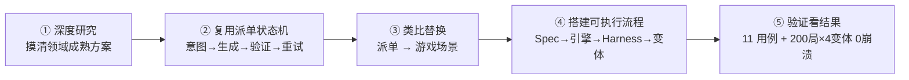

# Block Blast Pipeline — Spec-Driven A/B Variant Generation for Casual Games

[](.github/workflows/ci.yml)

> **一句话定位：** 一条把"一份参数化 Spec"自动喷成"多个经 Harness 验证的 A/B 游戏变体"的 AI Coding 流水线，让变体的验证从人手逐个测变成一键跑门禁。以方块消除（Block Blast 类）为负载演示。
>
> **One line:** an AI-coding pipeline that turns *one parameterized spec* into *many Harness-verified A/B game variants*. The game is the payload; the verifiable generation pipeline is the product.

**🎮 在线可玩（点开即玩，切变体看行为差异）：** https://symlp.github.io/block-blast-pipeline/?variant=compact
　切 `?variant=control | compact | relaxed | hard-mode` —— 同一份引擎，四种行为。

**🏛️ 我们怎么造出来的（一图看懂的流程引导）：** **https://symlp.github.io/block-blast-pipeline/process.html**

---

## 0. 流程引导：这个 demo 是怎么一步步造出来的

> 核心思路：**不是从零做游戏，是把我在另一个 agent 项目（指标告警自动派单 incident-dispatch-agent）里先跑通的那套「意图→生成→验证→失败重试」状态机，换个 payload 落到"游戏变体生成"场景。** 那套状态机是我自己写的、本机能跑的练手项目，不在本仓里，也没有可点的公开链接——这里只是说明本流水线的骨架是从那儿搬过来的，不是为这个 demo 从零现搭。



| # | 环节 | 做了什么 | 为什么这么做 |
|---|---|---|---|
| 1 | **深度研究** | 6 路并行调研：手感 / 玩法 / A·B 变体 / SDD / Harness / Agent 架构 | 每一环都有成熟工业方法，先摸清 state-of-the-art，不重复造轮子 |
| 2 | **复用派单状态机** | 拿我先跑通的「告警→分类→派单→核验→失败重派」状态机 + 治理五件套当骨架 | 复用一套已经跑通的状态机当地基，不从零设计 |
| 3 | **类比替换** | 把每个派单节点一对一换成「游戏变体生成」节点 | 两场景同构 → 换 payload、不换架构，经验直接复用 |
| 4 | **搭建可执行流程** | Spec → config → 纯 JS 引擎 → 三层 Harness → 4 变体 → CI | 一切可变量收敛进一份 config，流水线才能自动流动 |
| 5 | **验证看结果** | 11 用例全过 + 4 变体×200 局 0 崩溃、行为实测显著不同 | Harness 让流水线无人化：验证比生成更快且可信 |

**步骤 ③ 的同构替换：**

| 指标派单（先跑通的练手项目） | → | 游戏变体生成（本作） |
|---|:-:|---|
| 告警分类 | → | 解析 Spec（`parse_spec`） |
| 自动派单 | → | 生成变体 config（`generate`） |
| 核验工单 | → | 跑 Harness 门禁（`run_harness`） |
| 失败重派 | → | 失败自修复（`reflect_and_fix`，**骨架/未接入**） |
| 护栏 / 人工确认 / 可观测 | → | 同思路迁移 |

完整的「办事大厅」式图文流程引导见 **[process.html](https://symlp.github.io/block-blast-pipeline/process.html)**。

---

## TL;DR（给 30 秒读者 / 机器初筛）

- **问题：** 休闲游戏一年跑上万次 A/B 实验、日均 300+，人手写变体到不了这个量级。
- **方案：** Spec(YAML) → AI 生成 → Harness 验证门禁 → N 个 config 变体 → CI/CD。
- **技术栈：** 纯 JS 引擎（零依赖、可 headless 测）+ Vitest/fast-check 属性测试 + Node headless 模拟 + 编排脚本（按 LangGraph 节点图组织，`build_variants.py`）+ claude CLI。
- **可玩 demo：** [在线点开即玩](https://symlp.github.io/block-blast-pipeline/?variant=compact)（切 `?variant=` 看同一引擎跑出不同行为）；本地跑见 §6。

---

## 1. 流水线全景（一张图）

```
[Spec(spec.yaml)] → [AI 生成] → [Harness L1/L2] → [N 个变体 config] → [CI/CD] → [A/B 上线]
   变体矩阵          parse_spec     属性测试         同引擎不同行为      push 门禁    Firebase 分桶（设想）
   EARS 验收         generate_code  headless 模拟    config-driven
   三层 Guardrail    · · · · · · ·  - - - - - - -
                     reflect_and_fix  L3 LLM-judge
                     （骨架/未接入）   （骨架/未接入）
```

实线 = 真跑通且进门禁的环节；虚线（reflect_and_fix 自修复回环、L3 LLM-judge）= 已搭骨架、prompt 装配是真的、但**尚未接入主回路**。完整工位说明 + LangGraph 节点图见 [`docs/pipeline.md`](docs/pipeline.md)。

## 2. Spec-Driven：一份 Spec 长什么样

代码（变体 config）是 Spec 的**派生物**，不是 Spec 是代码的注释。[`spec.yaml`](spec.yaml) 里有：

- **变体矩阵** — 4 个 A/B 臂（control / compact / relaxed / hard-mode），每个声明 `intent` + `overrides`。
- **EARS 验收标准** — `WHEN … THE SYSTEM SHALL …` + few-shot 样例（消行、可解性保证、game over、确定性、差异性）。
- **三层 Guardrail** — Always / Ask-first / Never，生成前喂给 agent（引擎零 DOM、变体必过 schema、放置逻辑禁用 `Math.random()` 等）。

参数收敛进一张 JSON Schema（[`config/schema.json`](config/schema.json)）——board / spawn / scoring / difficulty / juice 五段，每个字段就是一个 A/B 维度。

## 3. Harness：怎么自动证明生成的变体是对的

这是作品的硬度来源。三层，全部可跑：

**Layer 1 — 属性测试（Vitest + fast-check）** · `harness/unit/invariants.test.js`
共 **11 个用例 = 6 条属性不变式（随机 play 下恒成立的契约）+ 5 条样例断言**。6 条不变式：① 棋盘恒 W×H ② 放置守恒（净增格子数 = piece.cellCount − 被消除清掉的格子数）③ 消行后无残留满行 ④ 非 game-over 必有合法落点 ⑤ score 单调不减 ⑥ combo 仅在连续消行递增。5 条断言：空盘放置只写 cellCount 格、combo 倍率随 combo 单调不减、消行分随行数/连击递增、4 变体均过 schema、canPlace 越界/重叠拒绝。

**Layer 2 — headless 模拟 + 引擎健壮性回归门禁（Node 跑 200 局/变体）** · `harness/sim/headless-sim.js`
确定性贪心 agent（每步选消行最多的放置，seed 可复现）。它**不是玩家技能模型**，而是个探针/fuzzer：自动把每个变体玩到结束，干两件事——(1) **门禁**：0 崩溃 + 每步 < 16ms（一帧预算），不过就 exit 1；(2) **行为指纹**：测出每个变体的 avgScore / avgSteps / avgLines，让 config 改动带来的差异是被**测出来的**而不是嘴上声明的。

**Layer 3 — LLM-as-Judge（骨架/未接入）** · `harness/eval/`
`claude -p` 读 rubric + 变体 config + sim 指标打分的骨架。prompt 装配与 claude 调用（OAuth 订阅登录、非 SDK）是真的，但**未接入 CI、不在门禁里跑**，需手动调用。

### 本次真实 sim 输出（200 局/变体，0 崩溃）

```
Headless sim — greedy agent, 200 games/variant

variant     games  crashes  avgScore   avgSteps   avgLines   maxStep(ms)
------------------------------------------------------------------------
control     200    0        71.8       12.3       4.3        1.02
compact     200    0        147.4      11.4       6.1        0.16
relaxed     200    0        358.6      75.3       19.4       0.29
hard-mode   200    0        63.9       4.8        2.2        0.15
------------------------------------------------------------------------

GATE PASSED: 0 crashes, worst step 1.02ms < 16ms across 4 variant(s).
```

读这张表（这才是 Harness 的价值——变体差异是被**测出来的**，不是嘴上说的）：

- **relaxed**（10×10 大棋盘、密度仅 0.3、minimal 小片库）存活 ~75 步、均分 ~359——明显比其它变体喘息更多、跑得更久。
- **hard-mode**（密度 0.65 开局就拥挤 + 大片为主 + 关掉 DDA 救援）只活 ~4.8 步——最短最残暴，符合声明意图。
- **compact**（7×7 小棋盘、二次连击、密度 0.7）每步得分最高、节奏最快。

四个变体的行为**显著不同**，证明 config-driven 变体是真的在改游戏行为，不是换皮。（density 真生效带来的副作用：开局预填使所有变体的总步数都比"空盘开局"短——这正是 density 参数被引擎读取的直接证据。）

## 4. Config-Driven 变体：同一引擎，N 种行为

下面全部是**引擎真读取、会改变玩法**的维度（每个都能在上面的 sim 数字里看到影响）：

| 玩法维度（引擎生效） | control | compact | relaxed | hard-mode |
|---|---|---|---|---|
| 棋盘 | 8×8 | 7×7 | 10×10 | 8×8 |
| 开局预填密度 | 0.5 | 0.7 | 0.3 | 0.65 |
| 片库 | standard | standard | minimal | extended |
| 大片权重 | 1.0 | 1.2 | 0.7 | 2.0 |
| 计分系数 | 5 | 6 | 5 | 8 |
| 连击曲线 | stepped | quadratic | linear | quadratic |
| DDA 动态难度 | 开 | 开 | 开 | 关 |

其中 **density**（reset 时按占用率预填棋盘）和 **DDA**（按实时占用率调发片权重：拥挤偏小片救援、空旷偏大片挑战）的实现见 `engine/board.js#prefillDensity` 与 `engine/pieces.js#ddaPool`。

> **手感/渲染层参数另算**（`line_clear_trauma` / `particles_per_cell` / `flash_alpha` 等）：这些被 `renderer/CanvasRenderer.js` 读取，影响视觉震屏/粒子/闪光，**不进玩法逻辑、headless sim 里不可见**，所以不放进上面的玩法 A/B 表。它们是真生效的（渲染层），只是属于另一层。

切换不刷页面（`ConfigLoader.loadVariant(id)` → fetch → 失败回退 control → `new GameEngine(config)`）。**浏览器运行时零依赖**（不依赖 CDN，断网也能开）；schema 校验是 **Node 侧的流水线门禁**（`config/validate.js` + 上面 Layer 1 的「变体符合 schema」检查），把校验放在 AI 生成新 config 的关口、而非玩家设备上。`ConfigLoader.js` 里留了**注释掉的 Firebase Remote Config 覆盖分支**，明示生产怎么用 `hash(expId+installId)` 分桶下发同一份代码的不同行为。

## 5. Agent 编排（LangGraph）

`scripts/build_variants.py` 是节点图收敛成的可读脚本：`parse_spec → generate_code → run_harness →（失败）reflect_and_fix（≤3 次）→ git_commit`。默认 dry-run（只跑门禁、不调 AI、零凭据）；`--live` 才调 `claude` 生成。

**这条 Spec-生成-验证-自修复状态机，与我另一个 agent 项目 incident-dispatch-agent（指标告警自动派单，我自己写的练手项目）同构**——告警分类=parse_spec、派单=generate_code、核验=run_harness、重派=reflect_and_fix，护栏/HITL/断路器/可观测性同思路可迁。所以这套骨架不是为本 demo 从零搭的，是换了个处理对象。注意：本仓里 `reflect_and_fix` 与 L3 judge 都还是**骨架（未接入主回路）**，committed 的 4 个变体本就过门禁、demo 不会走进自修复分支。映射详见 [`docs/pipeline.md`](docs/pipeline.md)。

## 6. 怎么跑起来

```bash
git clone <repo> && cd block-blast-pipeline
npm install

# Layer 1 — 属性测试（< 1 秒）
npm test                 # 等价 npx vitest run harness/unit

# Layer 2 — headless AI 玩家
npm run sim              # 200 局/变体；--games N / --variant id 可调
node harness/sim/headless-sim.js --variant relaxed --games 500

# 流水线 dry-run（跑门禁、不调 AI）
python scripts/build_variants.py

# 可玩 demo（需起静态服务，因为用了 fetch 加载 config）
npx serve .              # 然后浏览器开 http://localhost:3000/index.html?variant=compact
```

## 7. 诚实的边界

- **用纯 JS Canvas 不用 Cocos**：为让流水线逻辑纯粹可测、不被引擎生命周期干扰。Cocos 概念对应关系 + 迁移成本见 [`docs/cocos-mapping.md`](docs/cocos-mapping.md)（render 层要重写，流水线架构不变）。
- **没接真实 Firebase / 真实玩家数据**：用本地 JSON 变体 + headless 模拟跑出行为指标；`ConfigLoader` 里留了远程覆盖的设想接口（注释掉的 Firebase Remote Config 分支），未真正接入。
- **headless agent 是个贪心探针，不是玩家技能模型**：它的作用是健壮性回归门禁（0 崩溃 / 帧预算）+ 测出变体行为指纹，不声称模拟真实玩家留存。策略层可升级（换更强的 agent），流水线不动。
- **Layer 3 judge 与 reflect_and_fix 自修复回环都是骨架**：prompt 装配与 claude 调用是真的，但未接入 CI、不在主门禁里跑。
- **"天级压到分钟级"是粗略估算**：本机一次 dry-run 门禁（11 用例 + 200 局×4 变体）跑完在分钟级；"天级"指的是人手写一个变体 + 手测的设想对照，没有严格基线测量，仅作量级直觉。

## 8. 设计依据 / 参考

- Game Juice：Vlambeer《The Art of Screenshake》、Jonasson & Purho《Juice it or lose it》(GDC 2012)、Penner easing。
- Spec-Driven Development：GitHub spec-kit、Amazon Kiro（EARS 语法）、Tessl。
- Harness Engineering：Mitchell Hashimoto 2026-02 命名；fast-check 属性测试；LLM-as-Judge / DeepEval。
- 玩法/数值：Block Blast / 1010! 计分逆向（消除 r 行 += factor·r·(r+1)/2）、DDA、Random-bag 可解性保证。
- A/B 落地：Firebase Remote Config 哈希分桶、Statsig、Metaplay config archive。
